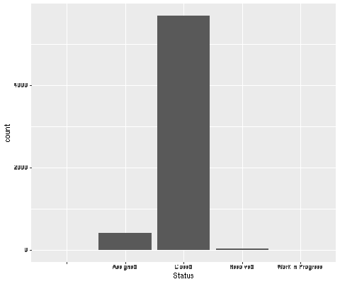
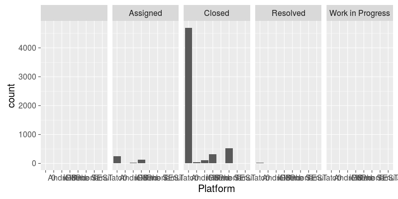
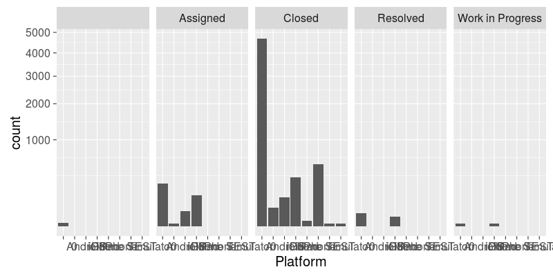
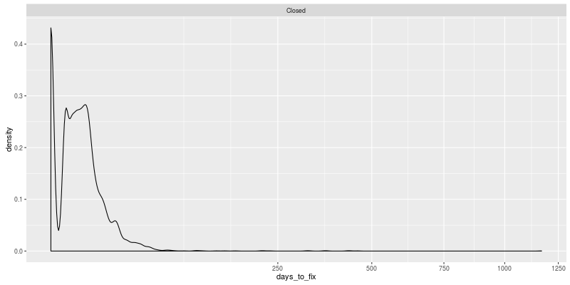
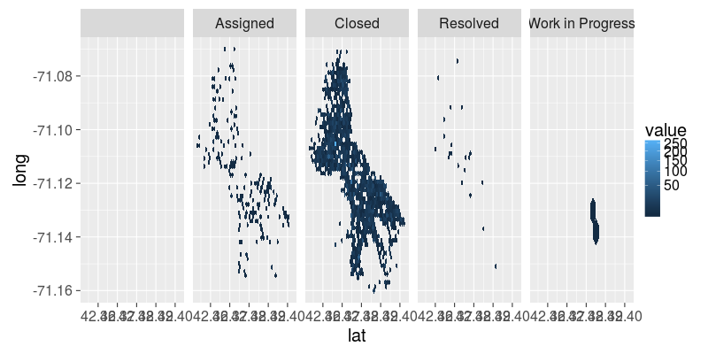
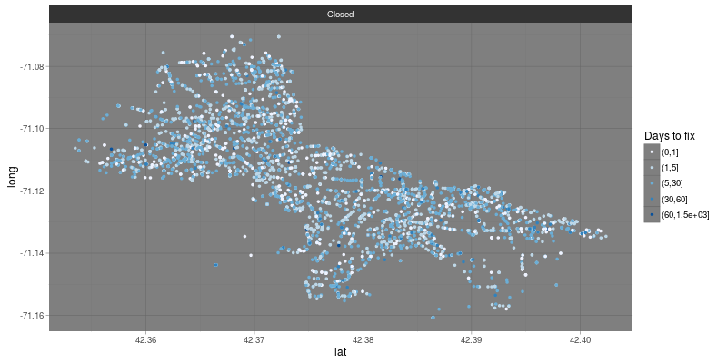
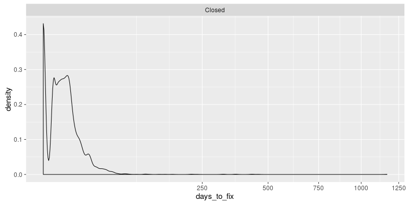

# R "magic": R in iPython


```
%load_ext rpy2.ipython
```

---

Use the prefix `%%R` in a cell and have the rest of the cell as R code.


```
%%R
R.version
```


                   _                                                 
    platform       x86_64-pc-linux-gnu                               
    arch           x86_64                                            
    os             linux-gnu                                         
    system         x86_64, linux-gnu                                 
    status         Under development (unstable)                      
    major          3                                                 
    minor          3.0                                               
    year           2016                                              
    month          03                                                
    day            03                                                
    svn rev        70270                                             
    language       R                                                 
    version.string R Under development (unstable) (2016-03-03 r70270)
    nickname       Unsuffered Consequences                           


---

# Longer R code


```
%%R
## Dobson (1990) Page 93: Randomized Controlled Trial :
counts <- c(18,17,15,20,10,20,25,13,12)
outcome <- gl(3,1,9)
treatment <- gl(3,3)
print(d.AD <- data.frame(treatment, outcome, counts))
glm.D93 <- glm(counts ~ outcome + treatment, family = poisson())
anova(glm.D93)
```


      treatment outcome counts
    1         1       1     18
    2         1       2     17
    3         1       3     15
    4         2       1     20
    5         2       2     10
    6         2       3     20
    7         3       1     25
    8         3       2     13
    9         3       3     12
    Analysis of Deviance Table
    
    Model: poisson, link: log
    
    Response: counts
    
    Terms added sequentially (first to last)
    
    
              Df Deviance Resid. Df Resid. Dev
    NULL                          8    10.5814
    outcome    2   5.4523         6     5.1291
    treatment  2   0.0000         4     5.1291


---

## Communicating with the outside world (Python)


```
FILENAME = "Pothole_Repair_Requests.csv"
```


```
%%R -i FILENAME
print(FILENAME)
```


    [1] "Pothole_Repair_Requests.csv"


```
%%R -o result
result <- 2*pi
```

---

# Data table

## Reading from a CSV file

### Pandas


```
import pandas
pdataf = pandas.read_csv(FILENAME)
```

---

### R "magic"


```
%%R
dataf <- read.csv(FILENAME)
```

---

### R from Python


```
from rpy2.robjects.packages import importr
utils = importr('utils')
```

---


```
dataf = utils.read_csv(FILENAME)
```


```
print(dataf.colnames)
```

    [1] "Request.ID"     "Status"         "Action.Type"    "Date.Submitted"
    [5] "Date.Completed" "Address"        "Platform"       "Submitted.By"  
    


---

# GGplot2 graphics

Build graphics with
- "layers"
- "mappings"

---


## R "magic"


```
%%R -i dataf
library(ggplot2)

p = ggplot(dataf) + 
    geom_bar(aes(x=Status))
print(p)    
```





---


```
%%R -i dataf
library(ggplot2)

p = ggplot2::ggplot(dataf) + 
    ggplot2::geom_bar(ggplot2::aes(x=Status))
print(p)
```


---

## R from Python


```
from rpy2.robjects.lib import ggplot2
import rpy2.ipython.ggplot as igp
```

    /home/laurent/Desktop/software/python/py35_env/lib/python3.5/site-packages/rpy2-2.8.0.dev0-py3.5-linux-x86_64.egg/rpy2/robjects/lib/ggplot2.py:59: UserWarning: This was designed againt ggplot2 version 2.0.0 but you have 2.1.0
      warnings.warn('This was designed againt ggplot2 version %s but you have %s' % (TARGET_VERSION, ggplot2.__version__))


```
gp = ggplot2
p = (gp.ggplot(dataf) + 
     gp.geom_bar(gp.aes_string(x='Status')))
type(p)
```


    rpy2.robjects.lib.ggplot2.GGPlot


---


```
from IPython import display
import tempfile
import io
import os
from rpy2 import robjects

def display_ggplot2(gg, width=800, height=400):
    """ Hook to render ggplot2 figures"""
    fn = tempfile.mktemp()
    try:
        robjects.r("png")(fn, type="cairo-png", 
                          width=width, height=height, 
                          antialias="subpixel")
        robjects.r("print")(gg)
        robjects.r("dev.off()")
        b = io.BytesIO()
        with open(fn, 'rb') as fh:
            b.write(fh.read())
    finally:
        if os.path.exists(fn):
            os.unlink(fn)
    data = b.getvalue()
    ip_img = display.Image(data=data, format='png', embed=True)
    return ip_img._repr_png_()

# register display func with PNG formatter:
png_formatter = get_ipython().display_formatter.formatters['image/png']
dpi = png_formatter.for_type(ggplot2.GGPlot, display_ggplot2)
```

---


```
p
```


---


```
p + gp.theme_gray(base_size=20)
```


---


```
p = (gp.ggplot(dataf) + 
     gp.geom_bar(gp.aes_string(x='Platform')) +
     gp.theme_gray(base_size=20))
p
```


---


```
p = (gp.ggplot(dataf) + 
     gp.geom_bar(gp.aes_string(x='Platform')) +
     gp.facet_grid('~Status') +
     gp.theme(**{'axis.text.x': gp.element_text(angle = 90, hjust = 1)}) +
     gp.theme_gray(base_size=20))
p
```





---


```
p + gp.scale_y_sqrt()
```





---

# dplyr


```
next(dataf[5].iter_labels())
```


    'Concord Ave\nCambridge, MA\n(42.38675507400046, -71.14068255199965)'


---


```
from rpy2.robjects.lib import dplyr
```

---


```
ddataf = dplyr.DataFrame(dataf)
```

---


```
import re
s_pat_float = '[+-]?[0-9.]+'
s_pat_coords = '.+\((%s), (%s)\)$' % (s_pat_float, s_pat_float)
pat_coords = re.compile(s_pat_coords,
                        flags=re.DOTALL)
from rpy2.robjects import NA_Real
def extract_coords(address):
    m = pat_coords.match(address)
    if m is None:
        return (NA_Real, NA_Real)
    else:
        return tuple(float(x) for x in m.groups())
```

---


```
extract_coords(next(ddataf[5].iter_labels()))
```


    (42.38675507400046, -71.14068255199965)


---


```
from rpy2.robjects.vectors import FloatVector
from rpy2.robjects import globalenv

globalenv['extract_lat'] = \
    lambda v: FloatVector(tuple(extract_coords(x)[0] for x in v))

globalenv['extract_long'] = \
    lambda v: FloatVector(tuple(extract_coords(x)[1] for x in v))

ddataf = (ddataf.
          mutate(lat='extract_lat(as.character(Address))',
                 long='extract_long(as.character(Address))',
                 date_submitted='as.POSIXct(Date.Submitted, format="%m/%d/%Y %H:%M:%S")',
                 date_completed='as.POSIXct(Date.Completed, format="%m/%d/%Y %H:%M:%S")').
          mutate(days_to_fix='as.numeric(date_completed - date_submitted, unit="days")'))
```

---


```
p = (gp.ggplot(ddataf) + 
     gp.geom_hex(gp.aes_string(x='lat', y='long'), bins=50) +
     gp.scale_fill_continuous(trans="sqrt") +
     gp.theme_gray(base_size=20) +
     gp.facet_grid('~Status'))
p
```


---


```
p = (gp.ggplot(ddataf.filter('Status == "Closed"')) + 
     gp.geom_density(gp.aes_string(x='days_to_fix')) +
     gp.facet_grid('~Status') +
     gp.scale_x_sqrt() +
     gp.theme(**{'legend.position': 'top'}))
p
```





---


```
p = (gp.ggplot(ddataf.filter('Status == "Closed"',
                             'days_to_fix < 100')) + 
     gp.geom_histogram(gp.aes_string(x='days_to_fix'), bins=100) +
     gp.facet_grid('~Status') +
     gp.theme(**{'legend.position': 'top'}))
p
```





---


```
p = (gp.ggplot(ddataf.filter('Status == "Closed"')) + 
     gp.geom_point(gp.aes_string(x='lat', y='long',
                                 color='cut(days_to_fix, c(0,1,5,30,60,1500))'),
                  size=1) +
     gp.facet_grid('~Status') +
     gp.theme_dark() +
     gp.scale_color_brewer("Days to fix"))
p
```





---


```
p = (gp.ggplot(ddataf.filter('Status == "Closed"')) + 
     gp.geom_histogram(gp.aes_string(x='date_completed'), bins=30) +
     gp.facet_grid('~Status') +
     gp.theme(**{'legend.position': 'top'}))
p
```


---


```
p = (gp.ggplot(ddataf.filter('Status %in% c("Closed", "Resolved")')) + 
     gp.geom_hex(gp.aes_string(x='date_submitted', y='date_completed')) +
     gp.facet_grid('~Status') +
     gp.scale_fill_continuous(trans="log") +
     gp.theme(**{'legend.position': 'top',
                 'axis.text.x': gp.element_text(angle = 45, hjust = .5)}))
p
```





---


```
extract_weekday = """
factor(weekdays(date_submitted),
       levels=c("Sunday", "Monday",
                "Tuesday", "Wednesday", "Thursday",
                "Friday", "Saturday"))
"""
# transition iPhone / iOS
ddataf = (ddataf.
          mutate(year_submitted='format(date_submitted, format="%Y")',
                 month_submitted='format(date_submitted, format="%m")',
                 weeknum_submitted='as.numeric( format(date_submitted+3, "%U"))',
                 weekday_submitted=(extract_weekday)).
	  filter('year_submitted >= 2012',
                 'Platform != ""'))
```

---


```
p = (gp.ggplot(ddataf) + 
     gp.geom_bar(gp.aes_string(x='(weekday_submitted)', fill='Platform')) +
     gp.scale_fill_brewer(palette = 'Set1') +
     gp.scale_y_sqrt() +
     gp.theme(**{'axis.text.x': gp.element_text(angle = 90, hjust = 1)}) +
     gp.facet_grid('month_submitted ~ year_submitted'))
display.Image(display_ggplot2(p, height=700))
```


